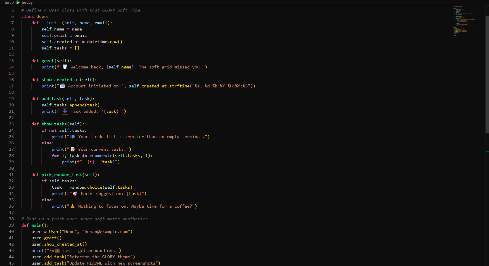
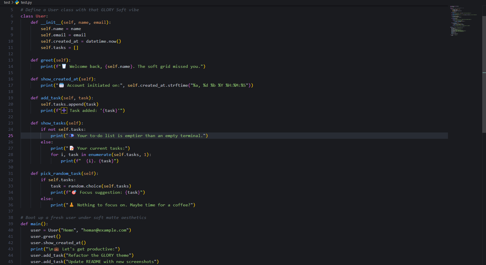

# GLORY Theme for VS Code

**GLORY**: Darker than your coffee, smoother than your commits.

Switch between **deep focus** and **smooth vibes** with three bold dark modes:  
🐍 **GLORY Deep** — for night owls and hackers  
🌙 **GLORY Soft** — for cozy focus with style  
✨ **GLORY Persian** — Code like every line is a verse of a poem
🌑 **GLORY Dark** — Minimalist contrast with neon highlights
---

## Screenshots

### 🐍 GLORY Deep (Python example)

### 🌙 GLORY Soft (Python example)

<!-- 
### ✨ GLORY Persian

-->

---

## Installation

1. Open **VS Code**
2. Go to **Extensions** (Ctrl+Shift+X)
3. Search for `GLORY Theme`
4. Click **Install** and pick your vibe

Or get it directly from the [Marketplace](https://marketplace.visualstudio.com/items?itemName=heman-sadeghi.glory-theme) 🚀

---

## Made with 💻 by [heman sadeghi](https://github.com/hemansadeghi)

_Not just a theme — a whole mood._
